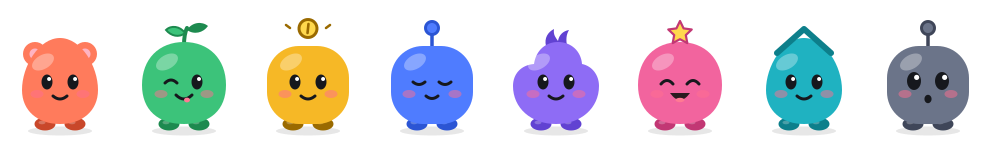
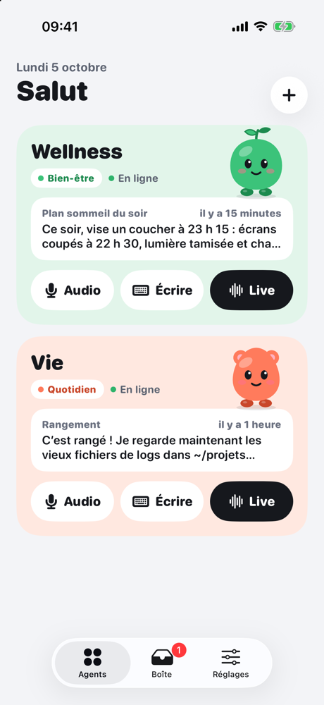
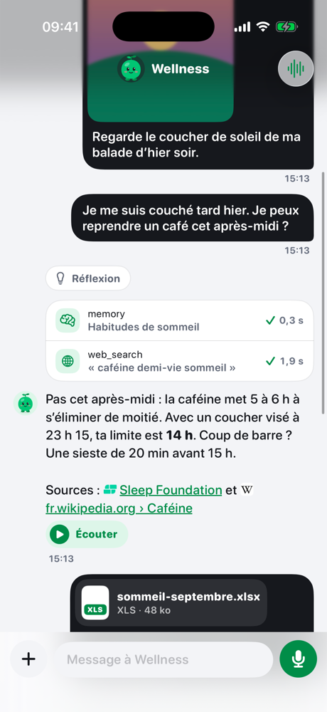
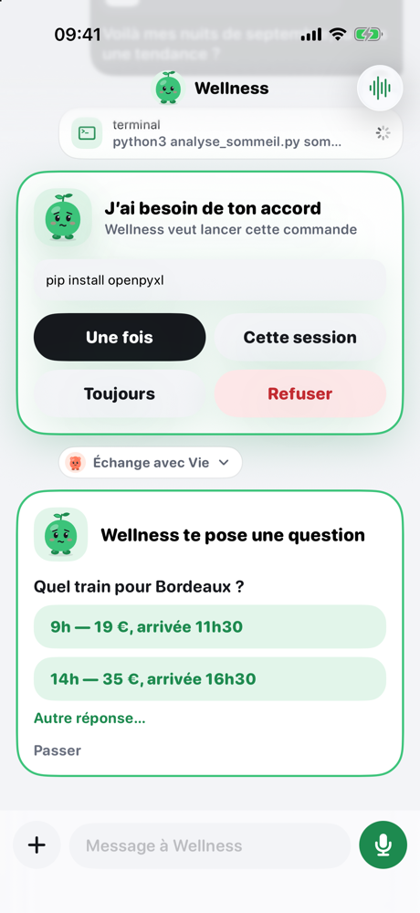
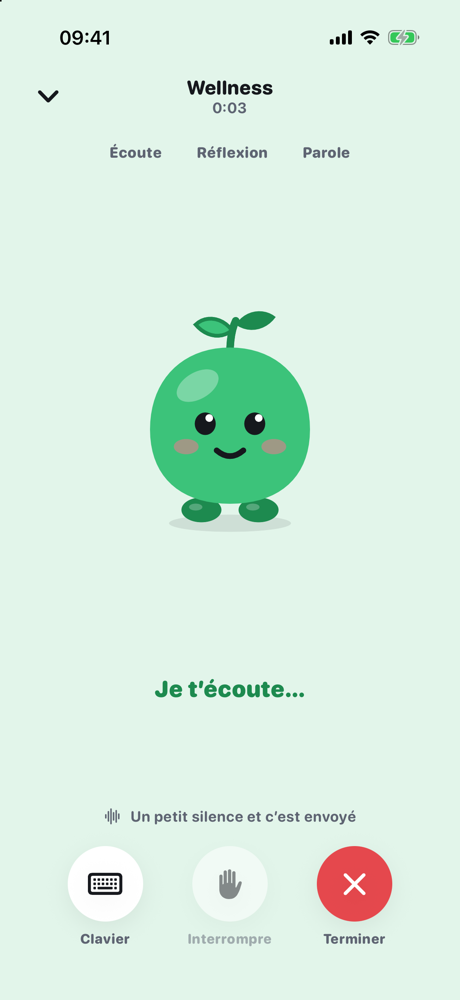
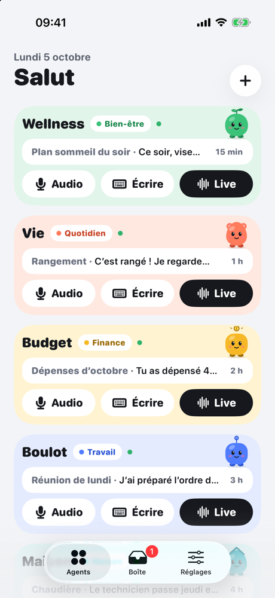
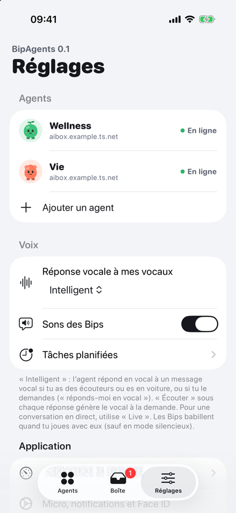
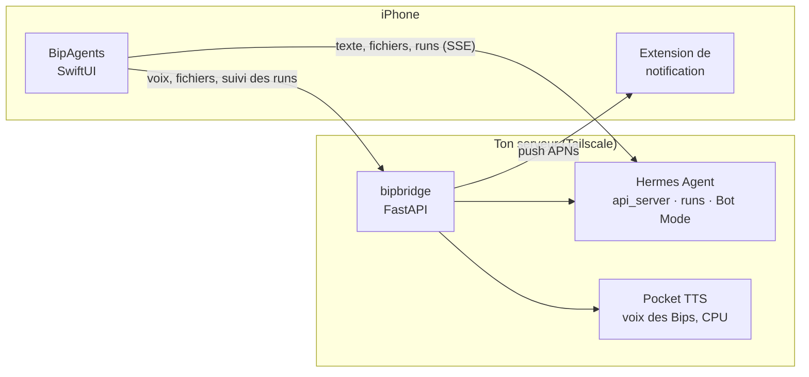

<a href="README.md">🇬🇧 English</a> · 🇫🇷 Français

  

<h1 align="center">BipAgents</h1>

  <b>Parle à tes agents IA auto-hébergés comme à des potes de poche.</b> 
  App iOS voice-first pour <a href="https://github.com/NousResearch/hermes-agent">Hermes Agent</a>, sur ton propre serveur, via Tailscale.

  
  
  
  
  

---

Chaque agent est un **Bip** : une petite mascotte avec sa couleur, sa forme, son humeur et **sa voix**. Wellness veille sur ton sommeil, Vie range tes fichiers, Budget surveille tes dépenses… Tu leur écris, tu leur parles, ou tu lances un **Live** pour discuter à voix haute, mains libres. Ils bossent sur **ton** serveur, et l'app te prévient quand ils ont fini, ou quand ils ont besoin de toi.

  
  
  
  

## 🎮 Joue avec les Bips

Les Bips ne sont pas que décoratifs. Dans l'app (et [**dans ton navigateur**](https://alexbob0.github.io/BipAgents/play/?lang=fr)), ils réagissent :

| Geste | Réaction |
|---|---|
| 👆 Toucher | un petit saut, un clin d'œil, une pirouette… au hasard |
| 👆👆👆 Trois touchers rapides, ou frotter vite | ça chatouille ! |
| 🫳 Caresser lentement | ronron, cœurs, joues roses |
| ✊ Appui long puis relâcher | **Boing !** |
| 😵 Trop les embêter | le tournis… puis ils boudent |

Et ils **babillent** : chaque réaction est dite dans leur « Animalese », un charabia mignon synthétisé à la volée, sans modèle ni réseau, avec une hauteur de voix propre à chaque Bip.

  <a href="https://alexbob0.github.io/BipAgents/play/?lang=fr"><b>→ Ouvrir le terrain de jeu des Bips</b></a>

## ✨ Ce que sait faire l'app

- 🎙️ **Voix d'abord** : notes vocales (maintenir « Audio » sur la carte d'un agent, relâcher, c'est parti), **Live** mains libres avec interruption à la voix, « Écouter » sous chaque réponse en streaming.
- 🗣️ **Une voix par Bip** : voix mignonnes Kyutai Pocket TTS, **sur CPU, sans GPU** (≈ 50 ms avant le premier son sur un Mac mini M4), en français, anglais, espagnol et allemand. Les nombres, symboles et abréviations sont rendus prononçables dans chaque langue.
- 🔒 **Ça continue écran verrouillé** : les messages partent en *runs* Hermes. Tu fermes l'app, l'agent finit son travail, et la réponse arrive en notification, avec l'avatar du Bip et le vrai texte.
- ✅ **Accords depuis l'écran verrouillé** : « Wellness veut lancer `pip install openpyxl` » → Une fois / Cette session / Toujours / Refuser, sans ouvrir l'app.
- ❓ **L'agent peut te poser une question** (outil `clarify`) : une carte avec un bouton par choix, comme sur Hermes Desktop.
- 🤝 **Les agents se parlent** : Vie peut consulter Wellness ; l'échange se replie en une ligne dans la conversation.
- 📬 **La Boîte** : rapports des tâches planifiées (cron), réponses arrivées pendant ton absence, à écouter ou à relancer en Live.
- 📎 **Tout type de fichier** : photos, PDF, Excel, scans… et les fichiers produits par l'agent (audio, documents) s'ouvrent dans l'app.
- 🌍 **En français, anglais, espagnol et allemand** : l'app suit la langue de l'iPhone, et chaque agent a sa propre langue (reconnaissance vocale et voix).
- 🔗 Liens cliquables avec favicons, outils repliés, brouillons gardés par conversation, séparateurs de jours.

<b>📸 Plus de captures</b>

 

  
  
  

## 🧩 Comment ça marche

- **L'app** parle directement à l'api_server Hermes (sessions, runs, accords, questions) et au **bridge** pour tout le reste.
- **Le bridge** (`bridge/`, Python) prépare et fait synthétiser les voix, sert les fichiers, relaie les runs pour qu'aucun événement ne se perde, surveille les tâches planifiées et envoie les notifications push.
- **Pocket TTS** (`pocket/`) donne leur voix aux Bips, sur le CPU de la même machine.
- Tout reste chez toi : aucun cloud tiers à part Apple pour les push. Aucun secret dans ce dépôt ; les clés sont saisies dans l'app (Trousseau) ou dans la config du bridge sur le serveur.

## 🚀 Démarrer

**Juste pour voir**, sans serveur : ouvre `BipAgents.xcodeproj`, schéma BipAgents → Arguments → `-demo`. Ajoute `-screen conversation`, `-screen call`, `-tab inbox` ou `-demoAgents 5` pour arriver directement sur un écran.

**Pour de vrai** : un **Mac mini**, un **VPS** ou un serveur Linux qui fait tourner [Hermes Agent](https://github.com/NousResearch/hermes-agent) suffit, sans GPU. Le guide pas à pas : [**Héberger BipAgents chez soi**](docs/self-hosting.fr.md) (Tailscale, api_server Hermes, Pocket TTS, bridge, lancement au démarrage, notifications).

> 🎙️ **Bonus** : avec un GPU Nvidia, Kyutai TTS 1.6B ajoute une voix humaine posée et sert à un podcast du matin généré par un agent. Facultatif, cf. la fin du guide.

<b>🗂️ Le dépôt</b>

- `App/` — l'app SwiftUI (iOS 18+, Swift 6).
  - `Design/` — thème, catégories, mascottes vectorielles (`MascotView`), interactions (`InteractiveMascot`), babillage (`BipBabble`), voix des agents.
  - `Model/` — `AgentStore` (agents dans l'App Group, clés dans le Trousseau), `BridgeClient`, `Router`.
  - `Features/` — Agents, Sessions, Conversation, Live, Boîte, Réglages, Diagnostics, notifications.
- `NotificationService/` — extension qui met le texte complet, l'avatar du Bip et l'audio dans les notifications.
- `Packages/HermesKit` — client de l'api_server Hermes (SSE, sessions, runs, accords, `clarify`, pièces jointes).
- `Packages/VoiceKit` — capture, transcription sur l'iPhone, TTS en flux PCM, interruption à la voix.
- `bridge/` — le service Python côté serveur ([README](bridge/README.fr.md)).
- `pocket/` — le serveur Pocket TTS des voix des Bips ([README](pocket/README.fr.md)).
- `voices/` — les voix des Bips ([README](voices/README.fr.md)).
- `docs/` — notes d'API ([`clarify`](docs/hermes-clarify-api.fr.md), [fichiers](docs/aibox-fichiers.fr.md)), captures, [terrain de jeu](docs/play/index.html) et bannière (`node docs/tools/banner.mjs` la régénère).
- [`SPEC.fr.md`](SPEC.fr.md) — la spécification complète.

## 💬 Qui est derrière

Un projet perso de **Bob**, qui creuse l'IA au quotidien : agents, voix, auto-hébergement.
Les coulisses, les galères et les prochains Bips sont sur X : **[@Bob_AI_Digger](https://x.com/Bob_AI_Digger)** 👋

Construit avec [Hermes Agent](https://github.com/NousResearch/hermes-agent) de Nous Research, les voix [Kyutai](https://kyutai.org), et beaucoup de sessions avec Claude.

MIT · Fait avec ♥ et des Bips

