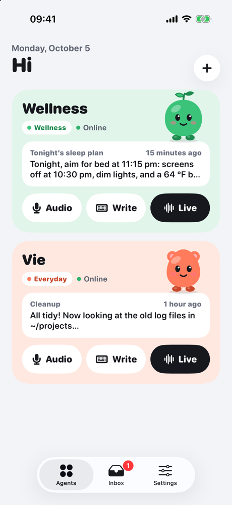
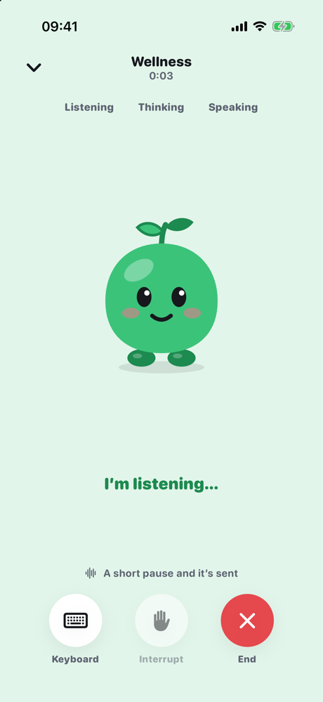
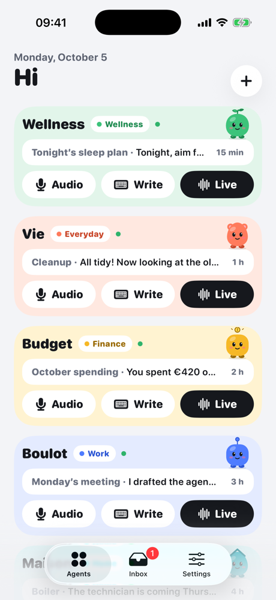
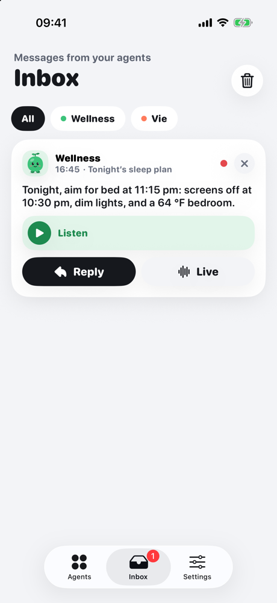
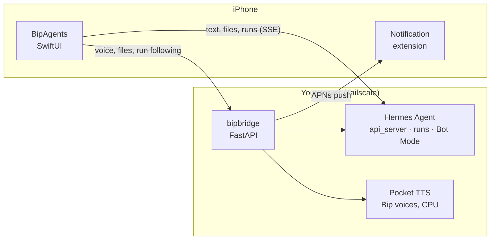

🇬🇧 English · <a href="README.fr.md">🇫🇷 Français</a>

  

<h1 align="center">BipAgents</h1>

  <b>Talk to your self-hosted AI agents like they're pocket-sized buddies.</b> 
  A voice-first iOS app for <a href="https://github.com/NousResearch/hermes-agent">Hermes Agent</a>, running on your own server, over Tailscale.

  
  
  
  
  

---

Every agent is a **Bip**: a little mascot with its own color, shape, mood and **voice**. Wellness looks after your sleep, Vie tidies your files, Budget keeps an eye on your spending… Text them, talk to them, or start a **Live** to chat out loud, hands-free. They work on **your** server, and the app lets you know when they're done, or when they need you.

  
  
  
  

## 🎮 Play with the Bips

The Bips aren't just decoration. In the app (and [**in your browser**](https://alexbob0.github.io/BipAgents/play/)), they react:

| Gesture | Reaction |
|---|---|
| 👆 Tap | a little hop, a wink, a twirl… at random |
| 👆👆👆 Three quick taps, or a fast rub | that tickles! |
| 🫳 Slow stroke | purring, hearts, rosy cheeks |
| ✊ Long press, then let go | **Boing!** |
| 😵 Pester them too much | they get dizzy… then sulk |

And they **babble**: every reaction is spoken in their "Animalese", cute gibberish synthesized on the fly, with no model and no network, and a pitch of its own for each Bip.

  <a href="https://alexbob0.github.io/BipAgents/play/"><b>→ Open the Bips playground</b></a>

## ✨ What the app does

- 🎙️ **Voice first**: voice notes (hold "Audio" on an agent's card, let go, done), hands-free **Live** you can interrupt just by talking, and "Listen" under every reply, streamed.
- 🗣️ **A voice per Bip**: cute Kyutai Pocket TTS voices, **on CPU, no GPU** (≈ 50 ms to first audio on an M4 Mac mini), in English, French, Spanish and German. Numbers, symbols and abbreviations are made speakable in each language.
- 🔒 **Keeps going on the lock screen**: messages are sent as Hermes *runs*. Close the app, the agent finishes its work, and the reply shows up as a notification, with the Bip's avatar and the actual text.
- ✅ **Approvals from the lock screen**: "Wellness wants to run `pip install openpyxl`" → Once / This session / Always / Deny, without opening the app.
- ❓ **The agent can ask you a question** (`clarify` tool): a card with one button per choice, like Hermes Desktop.
- 🤝 **Agents talk to each other**: Vie can consult Wellness; the exchange folds into a single line in the conversation.
- 📬 **The Inbox**: scheduled-task (cron) reports and replies that arrived while you were away, to listen to or pick up in Live.
- 📎 **Any kind of file**: photos, PDFs, spreadsheets, scans… and files the agent produces (audio, documents) open right in the app.
- 🌍 **In English, French, Spanish and German**: the app follows the iPhone's language, and each agent has its own (speech recognition and voice).
- 🔗 Clickable links with favicons, folded tool calls, drafts kept per conversation, day separators.

<b>📸 More screenshots</b>

 

  
  
  

## 🧩 How it works

- **The app** talks straight to the Hermes api_server (sessions, runs, approvals, questions) and to the **bridge** for everything else.
- **The bridge** (`bridge/`, Python) prepares and synthesizes speech, serves files, relays runs so no event gets lost, watches scheduled tasks and sends push notifications.
- **Pocket TTS** (`pocket/`) gives the Bips their voices, on the same machine's CPU.
- Everything stays with you: no third-party cloud except Apple for push. No secrets in this repo; keys are entered in the app (Keychain) or in the bridge config on the server.

## 🚀 Getting started

**Just to have a look**, no server needed: open `BipAgents.xcodeproj`, BipAgents scheme → Arguments → `-demo`. Add `-screen conversation`, `-screen call`, `-tab inbox` or `-demoAgents 5` to land straight on a screen.

**For real**: a **Mac mini**, a **VPS** or a Linux box already running [Hermes Agent](https://github.com/NousResearch/hermes-agent) is enough, no GPU. Step-by-step guide: [**Self-hosting BipAgents**](docs/self-hosting.md) (Tailscale, Hermes api_server, Pocket TTS, bridge, start at boot, notifications).

> 🎙️ **Bonus**: with an Nvidia GPU, Kyutai TTS 1.6B adds a calm human voice and powers a morning podcast generated by an agent. Optional, see the end of the guide.

<b>🗂️ The repo</b>

- `App/` — the SwiftUI app (iOS 18+, Swift 6).
  - `Design/` — theme, categories, vector mascots (`MascotView`), interactions (`InteractiveMascot`), babbling (`BipBabble`), agent voices.
  - `Model/` — `AgentStore` (agents in the App Group, keys in the Keychain), `BridgeClient`, `Router`.
  - `Features/` — Agents, Sessions, Conversation, Live, Inbox, Settings, Diagnostics, notifications.
  - `Resources/` — string catalogs (English, French, Spanish, German) and voice previews.
- `NotificationService/` — extension that puts the full text, the Bip's avatar and the audio into notifications.
- `Packages/HermesKit` — Hermes api_server client (SSE, sessions, runs, approvals, `clarify`, attachments).
- `Packages/VoiceKit` — capture, on-device transcription, streamed PCM TTS, voice barge-in.
- `bridge/` — the server-side Python service ([README](bridge/README.md)).
- `pocket/` — the Pocket TTS server for the Bips' voices ([README](pocket/README.md)).
- `voices/` — the Bips' voices ([README](voices/README.md)).
- `docs/` — API notes ([`clarify`](docs/hermes-clarify-api.md), [files](docs/aibox-fichiers.md)), screenshots, [playground](docs/play/index.html) and banner (`node docs/tools/banner.mjs` rebuilds it).
- [`SPEC.md`](SPEC.md) — the original spec.

## 💬 Who's behind it

A personal project by **Bob**, who digs into AI every day: agents, voices, self-hosting.
Behind the scenes, the struggles and the next Bips are on X: **[@Bob_AI_Digger](https://x.com/Bob_AI_Digger)** 👋

Built with [Hermes Agent](https://github.com/NousResearch/hermes-agent) by Nous Research, [Kyutai](https://kyutai.org)'s voices, and many sessions with Claude.

MIT · Made with ♥ and Bips

